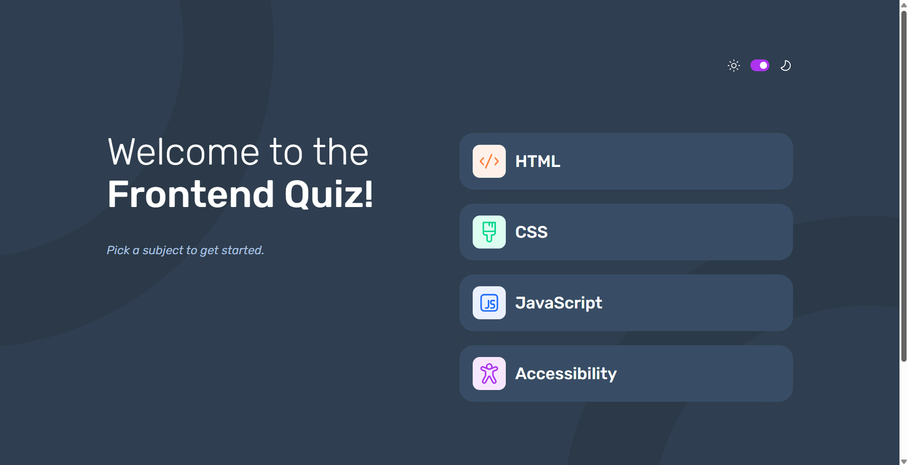

# Frontend Mentor - Frontend quiz app solution

This is a solution to the [Frontend quiz app challenge on Frontend Mentor](https://www.frontendmentor.io/challenges/frontend-quiz-app-BE7xkzXQnU). Frontend Mentor challenges help you improve your coding skills by building realistic projects. 

## Table of contents

- [Overview](#overview)
  - [The challenge](#the-challenge)
  - [Screenshot](#screenshot)
  - [Links](#links)
- [My process](#my-process)
  - [Built with](#built-with)
  - [What I learned](#what-i-learned)
  - [Continued development](#continued-development)
  - [Useful resources](#useful-resources)
- [Author](#author)
- [Acknowledgments](#acknowledgments)
- [Setup](#setup)

**Note: Delete this note and update the table of contents based on what sections you keep.**

## Overview

### The challenge

Users should be able to:

- Select a quiz subject
- Select a single answer from each question from a choice of four
- See an error message when trying to submit an answer without making a selection
- See if they have made a correct or incorrect choice when they submit an answer
- Move on to the next question after seeing the question result
- See a completed state with the score after the final question
- Play again to choose another subject
- View the optimal layout for the interface depending on their device's screen size
- See hover and focus states for all interactive elements on the page
- Navigate the entire app only using their keyboard
- **Bonus**: Change the app's theme between light and dark

### Screenshot



### Links

- Solution URL: [GitHub Repo](https://github.com/Achigyus/frontend-quiz-app)
- Live Site URL: [Live Site](https://frontend-quiz-app-achigyus.netlify.app/)

## My process

### Built with

- Semantic HTML5 markup
- CSS custom properties
- Flexbox
- Mobile-first workflow
- [SASS](https://sass-lang.com/) - CSS with superpowers
- Typescript
- NodeJs
- Express
- MongoDB

### What I learned

This project was a huge learning opportunity for me. I learned how to create and host a database on mongoDB Atlas.
I also learneed how to communicate with my database through setting up a nodejs/express server on my local machine. I also learned how to deploy the server to a hosting site and use CORS to limit traffic.
I also learnt alot about CSS variables

Here's some of the things I learnt:

CSS Variables
```css
:root
    --background_color: #{vars.$light_gray}
    --text_color: #{vars.$dark_navy}
    --sec_text_color: #{vars.$gray_navy}
    --bg_img: url('../assets/images/pattern-background-mobile-light.svg')
    --bg_img_tab: url('../assets/images/pattern-background-tablet-light.svg')
    --bg_img_desk: url('../assets/images/pattern-background-desktop-light.svg')
    --btn_color: #{vars.$white}

[data-theme="dark"]
    --background_color: #{vars.$dark_navy}
    --text_color: #{vars.$white}
    --sec_text_color: #{vars.$light_blue}
    --bg_img: url('../assets/images/pattern-background-mobile-dark.svg')
    --bg_img_tab: url('../assets/images/pattern-background-tablet-dark.svg')
    --bg_img_desk: url('../assets/images/pattern-background-desktop-dark.svg')
    --btn_color: #{vars.$navy}
```

Connecting to MongoDB with env vars
```js
module.exports = {
    connectToDb: (cb) => {
        MongoClient.connect(process.env.MONGO_URI)
            .then((client) => {
                dbConnection = client.db()
                return cb()
            })
            .catch((err) => {
                console.log(err)
                return cb(err)
            })
    },
    getDb: () => {
        return dbConnection
    }
}
```


### Continued development

Moving forward I will continue working on accessibility, typescript, and creating more full stack websites.

### Useful resources

- [MongoDB Resource](https://www.example.com) - bro literally taught me the basics of MongoDb from zero to deployment. I highly recommend.


## Author

- Website - [Achigyus](https://github.com/Achigyus)
- Frontend Mentor - [@Achigyus](https://www.frontendmentor.io/profile/Achigyus)

## Acknowledgments

Hats offf to [Firat](https://www.frontendmentor.io/profile/firatyedibela). His solution helped get me back on track when I was really confused.

## Setup
- Download the project files
- Extract them and navigate into the folder
- Open a terminal in the folder and run npm install to get all dependencies
- Use live server to serve the project
- Run npm run watch to watch any changes in index.ts
- Run gulp to check and compile changes in index.sass
- To run the server, install the dependencies in the server folder and fill in the sample env with your own credentials